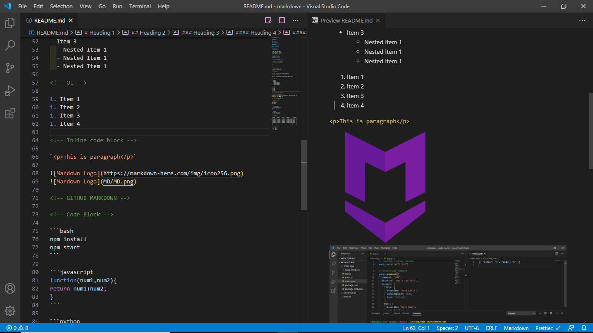

<!-- Heading -->

# Heading 1

## Heading 2

### Heading 3

#### Heading 4

##### Heading 5

###### Heading 6

<!-- Italics -->

_This text is italic_
\*This text is italic\*
_This text_ is italic

<!-- Strong -->

**This is strong**
**This is strong**

<!-- Strikethrough -->

~~This is strikethrough~~

<!-- Horizontal Rule -->

---

---

<!-- BlockQuotes -->

> This is blockquotes

<!-- Links -->

[Ujjwal Singh](https://ujjwalsingh.com)

<!-- with title -->

[Ujjwal Singh](https://ujjwalsingh.com "UJJWAL")

<!-- UL -->

- Item 1
- Item 2
- Item 3
  - Nested Item 1
  - Nested Item 1
  - Nested Item 1

<!-- OL -->

1. Item 1
1. Item 2
1. Item 3
1. Item 4

<!-- Inline code block -->

`<p>This is paragraph</p>`




<!-- GITHUB MARKDOWN -->

<!-- Code Block -->

```bash
npm install
npm start
```

```javascript
function(num1,num2){
return num1+num2;
}
```

```python
def add(num1,num2):
  return num1+num2
```

<!-- Table -->

| Name    | Email   | Phone    | Address      | Pincode |
| ------- | ------- | -------- | ------------ | ------- |
| Example | example | 98754321 | example road | 12345   |
| Example | example | 98754321 | example road | 12345   |
| Example | example | 98754321 | example road | 12345   |
| Example | example | 98754321 | example road | 12345   |
| Example | example | 98754321 | example road | 12345   |
|         |         |          |              |         |
|         |         |          |              |         |

<!-- Task List -->

- [x] Task 1
- [x] Task 1
- [ ] Task 1
